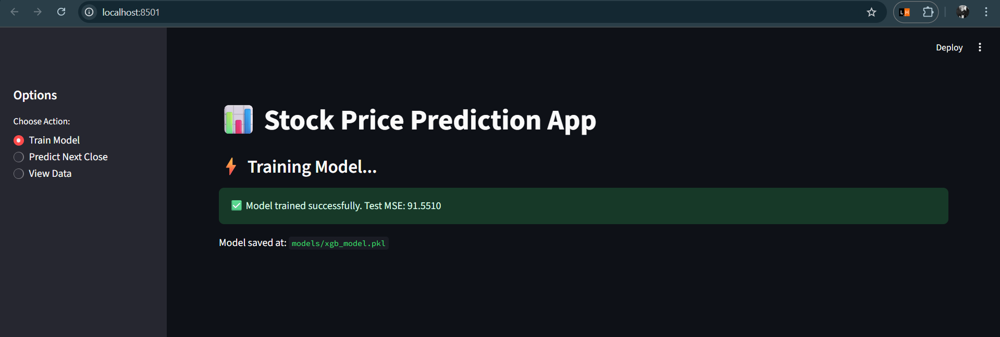
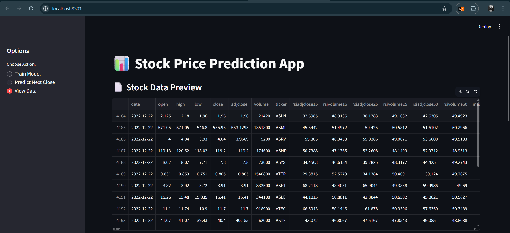
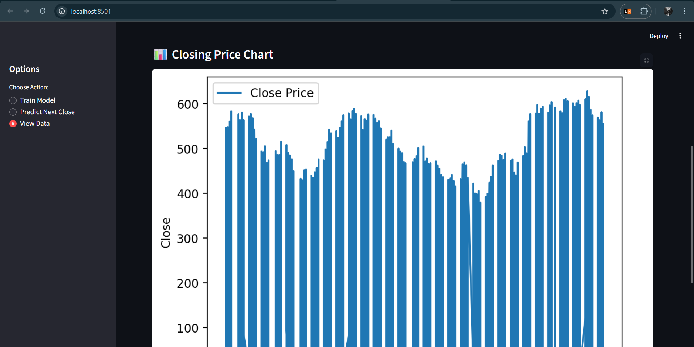
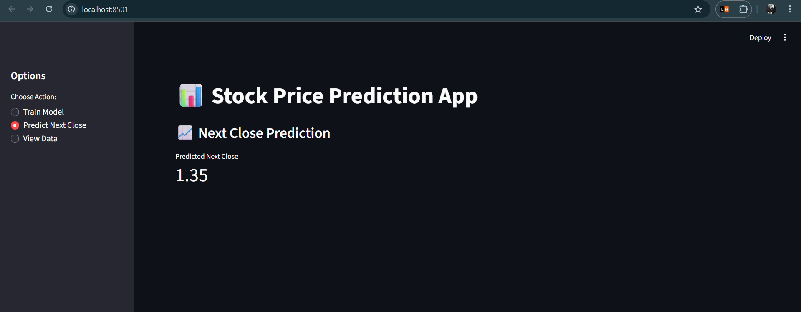

# 📊 Stock Price Prediction App

A machine learning-based stock price prediction system built with **Python, XGBoost, and Streamlit**.  
It allows you to train a model, view stock data, and predict the next closing price with an interactive UI.

---

## 🚀 Features
- Load and preprocess stock market data
- Train XGBoost regression model
- Predict the next day's closing price
- Interactive charts and metrics using Streamlit
- Simple UI for quick experimentation

---

## 📸 Snapshots

### 🏠 Home Page


### 📈 Model Training



### 🔮 Prediction


---

## ⚙️ Installation

```bash
# Clone the repository
git clone https://github.com/your-username/stock-predictor-updated.git
cd stock-predictor-updated

# Create virtual environment
python -m venv venv
source venv/bin/activate    # On Windows: venv\Scripts\activate

# Install dependencies
pip install -r requirements.txt

# Run the Streamlit app
streamlit run app.py
